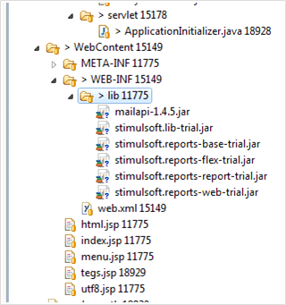
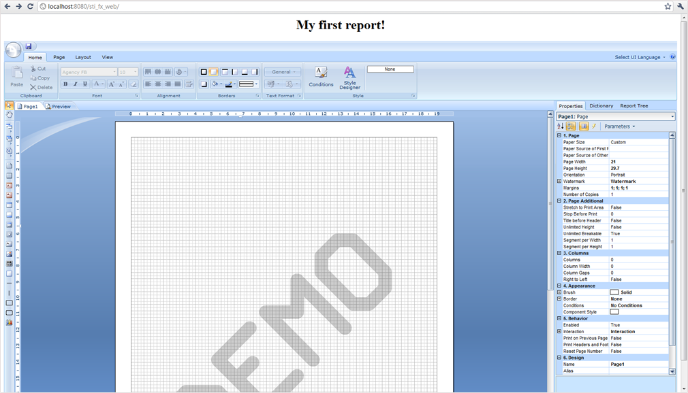

## Creating Sample Page with Report Designer

Create a simple page with a report designer. To do this, put the following libraries into the **WebContent\WEB-INF\lib\** directory: stimulsoft.lib.jar, stimulsoft.reports-base.jar, stimulsoft.reports-report.jar, stimulsoft.reports-flex.jar, stimulsoft.reports-web.jar. As a result, one can see the following (picture below):




Next, open the **web.xml** for editing, it should look like in Listing 2:


**web.xml**

```xml
...
<?xml version="1.0" encoding="UTF-8" ?>
<web-app xmlns:xsi="http://www.w3.org/2001/XMLSchema-instance"
    xmlns="http://java.sun.com/xml/ns/javaee" xmlns:web="http://java.sun.com/xml/ns/javaee/webapp_2_5.xsd"
    xsi:schemaLocation="http://java.sun.com/xml/ns/javaee"
    id="WebApp_ID" version="2.5">
    <display-name>sti_webviewer</display-name>
    <welcome-file-list>
        <welcome-file>index.jsp</welcome-file>
    </welcome-file-list>
    <!-- configuration, this parameter indicates the main application directory -->
    <servlet>
        <servlet-name>StimulsoftResource</servlet-name>
        <servlet-class>com.stimulsoft.web.servlet.StiWebResourceServlet</servlet-class>
    </servlet>
    <servlet-mapping>
        <servlet-name>StimulsoftResource</servlet-name>
        <url-pattern>/stimulsoft_web_resource</url-pattern>
    </servlet-mapping>
    <servlet>
        <servlet-name>StimulsoftAction</servlet-name>
        <servlet-class>com.stimulsoft.webviewer.servlet.StiWebViewerActionServlet</servlet-class>
    </servlet>
    <servlet-mapping>
        <servlet-name>StimulsoftAction</servlet-name>
        <url-pattern>/stimulsoft_webviewer_action</url-pattern>
    </servlet-mapping>
</web-app>
...
```

Leave unchanged the remaining web.xml blocks, which defines the servlets required for working. Then, edit the index.jsp (see the code below).


**Index.jsp**

```
...
<!DOCTYPEhtmlPUBLIC"-//W3C//DTD HTML 4.01 Transitional//EN">
<%@ page language="java" contentType="text/html; charset=UTF-8" pageEncoding="UTF-8" %>
<%@ taglib uri="http://stimulsoft.com/designer" prefix="stidesignerfx" %>
<%@ taglib uri="http://stimulsoft.com/viewer" prefix="stiviewerfx" %>

<html>
<head>
    <meta http-equiv="Content-Type" content="text/html; charset=UTF-8">
    <title>Stimulsoft Reports.Fx for Java</title>
</head>
<body>
<h1 align="center">My first report!</h1>
<stidesignerfx:iframe
    width="100%" height="90%" align="middle"
    styleClass="" frameborder="0" styleId=""
    marginheight="4" marginwidth="10" name="stiviewer"
    scrolling="no" style="" title="report"/>
</body>
</html>
...
```

Add taglib directives in the JSP (Listing 5). They will work with custom tags on the page.


**Index.jsp**

```
...
<%@ taglib uri="http://stimulsoft.com/designer" prefix="stidesignerfx" %>
<%@ taglib uri="http://stimulsoft.com/viewer" prefix="stiviewerfx" %>
...
```

Add a tag `<stidesignerfx:iframe/>`, an analog of an html tag iframe with the support of all its attributes. See the following as a result of the application deployment, (see the picture below):




There is a division into two components: DesignerFx and ViewerFx, it can be seen from Listing 5. Consider a DesignerFx component. For a ViewerFx it works the same way. Tags:


**Index.jsp**

```
...
<stidesignerfx:link text="a link for jumping to the Designer"/>
<stidesignerfx:button value="a button for jumping to the Designer"/>
<stidesignerfx:frame title="analog of the html tag frame which contains a Designer"/>
<stidesignerfx:iframe title="analog of the html tag iframe which contains a Designer"/>
...
```

All these are analogs of similar HTML tags, supporting all the attributes. A list of standard attributes is expanded for displaying the report and setting variables for the report. The report = "SimpleList.mrt" attribute opens the report with the name SimpleList.mrt. Variables in the Report can be passed in two ways:

* Set the value of a variableStr attribute as a string in the following format: "Variable1 = value1 & Variable2 = value2". In this case, two variables Variable1 with a value1 and Variable2 with a value2 in the report will be passed. For example, you need to edit the index.jsp file to open a report with the name MyFirstReport.mrt by clicking the button and the MyVar report variable has the stidesignerfx value (Listing 5).


**Index.jsp**

```
...
<!DOCTYPEhtmlPUBLIC"-//W3C//DTD HTML 4.01 Transitional//EN">
<%@ page contentType="text/html;charset=UTF-8" import="java.util.*" %>
<%@ taglib uri="http://stimulsoft.com/designer" prefix="stidesignerfx" %>
<%@ taglib uri="http://stimulsoft.com/viewer" prefix="stiviewerfx" %>

<html>
<head>
    <title>Report</title>
    <meta http-equiv="Content-Type" content="text/html; charset=UTF-8" />
</head>

<body>
    <stidesignerfx:button value="Run the report designer" report="MyFirstReport.mrt" variableStr="MyVar=stidesignerfx" />
</body>
</html>
...
```

* It is also possible to pass parameters to a report as a Map &lt;String, String&gt;. Redesign our webpage as follows (Listing 6). In this case, a report with the name MyFirstReport.mrt will be loaded in a report and two parameters will be passed into it:


**Index.jsp**

```
...
<!DOCTYPEhtmlPUBLIC"-//W3C//DTD HTML 4.01 Transitional//EN">
<%@ page contentType="text/html;charset=UTF-8" import="java.util.*" %>
<%@ taglib uri="http://stimulsoft.com/designer" prefix="stidesignerfx" %>
<%@ taglib uri="http://stimulsoft.com/viewer" prefix="stiviewerfx" %>

<html>
<head>
<title>Report</title>
<meta http-equiv="Content-Type" content="text/html; charset=UTF-8" />
</head>
<body>
<%
    Map<String, String>variableMap= new HashMap<String, String>();
    variableMap.put("Variable1", "var1");
    variableMap.put("Variable2", "var2");
    request.setAttribute("myMap", variableMap);
%>
<stidesignerfx:iframe report="MyFirstReport.mrt" variableMap="myMap"
    width="100%" height="100%" align="right"
    styleClass="" frameborder="0" styleId=""
    marginheight="1" marginwidth="1" name="stidesignerfx"
    scrolling="no" style="" title="report" />

</body>
</html>
...
```

Data here are passed as a HashMap, this parameter should be set to the request or session, and the key under which it will be there should be passed to the tag as a variableMap attribute. Applying two attributes variableMap and variableStr is not allowed.
