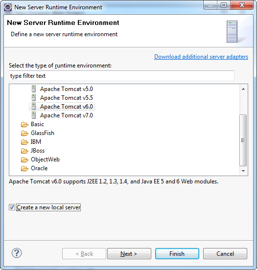
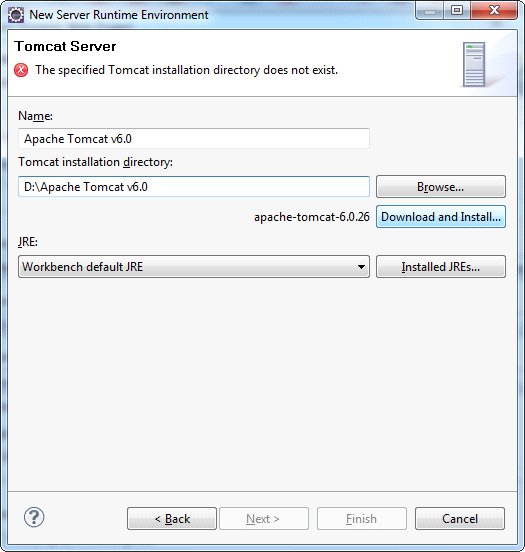

## Creating Server

Under Target Runtime, you see &lt;None&gt;, as shown in the picture below, because you haven't created a runtime yet for Apache Tomcat. Click New Runtime to open the New Target Runtime Wizard. Select Apache Tomcat of the correct version from a list. Check Create a new local server as shown on Figure 3, then click Next.

Then define the Tomcat installation directory, in which Apache Tomcat is installed, or in which one needs to install it, as shown in the picture. If it is not installed, then click Download and Install. After all fields are specified, click Finish.

